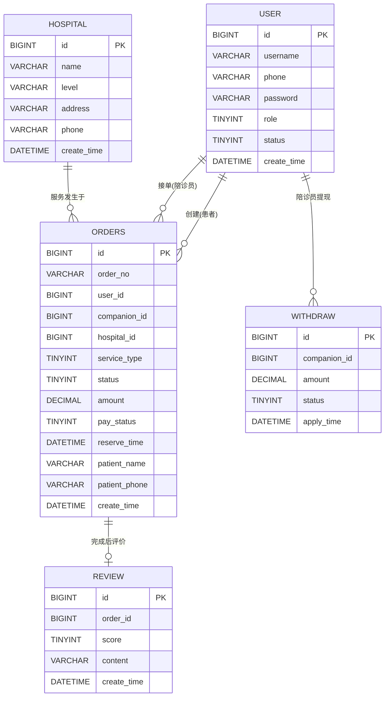

# X.X 功能模块设计

本系统面向县级医院陪诊业务场景，围绕“患者下单、陪诊员接单履约、管理员运营审核”三类核心活动进行功能解耦。系统采用前后端分离实现方式：前端基于 Vue3 + Vite + Pinia + Element Plus，后端基于 Spring Boot + MyBatis-Plus，数据层采用 MySQL。为保证结构清晰、职责单一与后续可扩展性，本文将系统划分为用户与认证、患者端业务、陪诊员端业务、订单核心管理、医院信息、管理后台、数据持久化、公共支撑共 8 个功能模块，并在统一业务边界下完成协同。

## X.X.1 模块划分依据与设计原则

系统功能模块划分遵循以下依据与原则：

1. 按业务角色与职责边界划分。患者、陪诊员、管理员在业务目标和操作集合上存在显著差异，故在表现层和业务层均进行角色化拆分。
2. 按领域能力聚合。将订单生命周期相关逻辑归并到订单核心管理模块，避免认证、医院信息、审核逻辑与订单逻辑耦合。
3. 按分层架构组织。采用“用户层-表现层-业务层-数据层”分层方式，确保调用方向自上而下，降低跨层依赖。
4. 按可维护性与可追溯性设计。模块命名与代码实现保持一致，可映射至控制器、服务、页面与数据表。
5. 按当前实现边界如实描述。已持久化能力与前端本地能力严格区分，其中评价记录与提现记录为当前版本前端 `localStorage` 实现。

## X.X.2 系统功能模块结构

**图X-X 县级医院陪诊管理系统功能模块结构图**

（此处插入“系统功能模块结构图”PNG 或 SVG 图片）

**图注说明：**  
该结构图分为四层：用户层、表现层、业务层、数据层。调用方向为“用户层 -> 表现层 -> 业务层 -> 数据层”。患者与陪诊员通过前端应用访问统一 REST API，管理员通过后台页面访问同一业务服务；业务服务通过 MyBatis-Plus 访问 MySQL 数据库。评价与提现记录在当前版本中由前端本地存储承载，不进入数据库持久化链路。

## X.X.3 各功能模块职责说明

### （1）用户与认证模块

**模块定位：** 负责系统用户身份建立、登录认证与基础资料维护，是患者端和陪诊员端的统一入口模块。  
**核心职责：**
1. 提供患者与陪诊员注册能力（含角色区分与状态初始化）。
2. 提供登录能力，校验手机号、密码、角色与账号状态。
3. 提供用户名修改能力，维护用户基础资料一致性。
4. 返回统一认证结果，供前端建立角色会话。
**输入：** 注册/登录/改名页面操作；`/api/auth/register/*`、`/api/auth/login`、`/api/auth/profile/username` 请求。  
**输出：** 用户注册结果、登录令牌（mock token）、用户角色与资料更新结果。  
**与其他模块关系：** 上游被患者端业务模块、陪诊员端业务模块调用；下游依赖数据持久化模块读写 `user` 数据。

### （2）患者端业务模块

**模块定位：** 承载患者视角的就医服务发起与订单查询操作。  
**核心职责：**
1. 提供医院浏览与选择入口。
2. 提供订单创建、支付、取消、查看列表与详情能力。
3. 提供评价功能入口（当前版本评价内容本地存储）。
4. 提供个人中心资料展示与改名入口。
**输入：** 患者页面交互；`/api/hospitals`、`/api/orders*`、`/api/auth/profile/username` 请求。  
**输出：** 患者订单数据、订单状态结果、医院列表与个人资料更新结果。  
**与其他模块关系：** 上游被患者角色触发；下游调用医院信息模块、订单核心管理模块、用户与认证模块，并通过公共支撑模块完成路由鉴权与会话隔离。

### （3）陪诊员端业务模块

**模块定位：** 承载陪诊员视角的接单履约与个人收益相关操作。  
**核心职责：**
1. 提供接单大厅与待接订单刷新能力。
2. 提供服务记录管理与服务状态推进能力。
3. 提供患者订单详情查看能力。
4. 提供收入统计与提现申请能力（当前版本提现记录本地存储）。
**输入：** 陪诊员页面交互；`/api/orders`、`/api/orders/{orderNo}/accept`、`/api/orders/{orderNo}/next`、`/api/auth/profile/username` 请求。  
**输出：** 接单结果、服务进度结果、订单明细、收入汇总结果与本地提现记录。  
**与其他模块关系：** 上游被陪诊员角色触发；下游调用订单核心管理模块与用户与认证模块，并经公共支撑模块完成角色会话管理。

### （4）订单核心管理模块

**模块定位：** 负责订单全生命周期控制，是系统业务主干模块。  
**核心职责：**
1. 提供订单创建、查询、删除等基础能力。
2. 提供支付、接单、取消、状态推进等流程控制能力。
3. 实现订单状态机主流程：`UNPAID -> WAITING_ACCEPT -> ACCEPTED -> IN_SERVICE -> TO_CONFIRM -> COMPLETED`。
4. 校验关键业务约束，如仅待支付订单可支付、仅待接单订单可被接单。
**输入：** 来自患者端、陪诊员端、管理后台的订单相关请求；`/api/orders*` 系列接口。  
**输出：** 订单视图数据（订单号、医院、服务类型、状态、金额、预约时间、患者信息等）。  
**与其他模块关系：** 上游被患者端业务模块、陪诊员端业务模块、管理后台模块调用；下游依赖数据持久化模块与医院信息、用户信息数据。

### （5）医院信息模块

**模块定位：** 提供医院主数据查询能力，为下单流程提供基础数据支撑。  
**核心职责：**
1. 提供医院列表查询能力。
2. 提供订单创建阶段的医院合法性校验依据。
3. 为前端展示医院名称、等级、地址、电话等信息。
**输入：** `/api/hospitals` 查询请求；订单模块的医院解析调用。  
**输出：** 医院列表数据与医院匹配结果。  
**与其他模块关系：** 上游被患者端业务模块、订单核心管理模块、管理后台模块调用；下游依赖数据持久化模块访问 `hospital` 表。

### （6）管理后台模块

**模块定位：** 为管理员提供运营与审核入口，承担平台治理功能。  
**核心职责：**
1. 提供陪诊员审核能力（通过/驳回）。
2. 提供后台订单管理能力（查询、推进、取消、删除、新建）。
3. 提供医院信息查看与运营概览能力。
**输入：** 管理后台页面操作；`/api/admin/companions/*`、`/api/orders*`、`/api/hospitals` 请求。  
**输出：** 陪诊员审核结果、订单运营结果、医院数据展示结果。  
**与其他模块关系：** 上游被管理员角色触发；下游调用订单核心管理模块、医院信息模块、数据持久化模块。

### （7）数据持久化模块

**模块定位：** 提供结构化业务数据的持久化读写与映射能力。  
**核心职责：**
1. 通过 MyBatis-Plus Mapper 实现数据访问封装。
2. 维护 `user`、`order_record/orders`、`hospital` 等核心表读写。
3. 向业务层提供按条件查询、更新、删除、关联查询能力。
**输入：** 各业务模块的数据访问请求与查询条件。  
**输出：** 实体对象、列表结果、更新/删除影响行数等持久化结果。  
**与其他模块关系：** 上游被用户与认证、订单核心、医院信息、管理后台模块共同依赖；下游对接 MySQL 数据库。

### （8）公共支撑模块

**模块定位：** 提供跨模块复用的通用能力，保障系统一致性与稳定性。  
**核心职责：**
1. 提供统一响应结构 `ApiResponse(code, message, data)`。
2. 提供全局异常处理 `GlobalExceptionHandler`，统一异常出口。
3. 提供前端路由守卫、角色会话隔离与基础请求封装能力。
**输入：** 各业务模块的成功响应与异常信息；前端通用会话操作。  
**输出：** 统一格式响应、统一错误信息、统一会话行为。  
**与其他模块关系：** 横向支撑全部业务模块，不承载独立业务流程，但决定系统交互一致性。

## X.X.4 模块间协作关系与数据流

### 1. 典型协作链路

1. 患者通过前端提交注册/登录请求，用户与认证模块完成身份校验并返回统一响应。
2. 患者在医院信息模块获取医院列表后，通过订单核心管理模块创建订单，订单数据经数据持久化模块写入数据库。
3. 患者支付后，订单状态由 `UNPAID` 进入 `WAITING_ACCEPT`；陪诊员在接单大厅执行接单，状态进入 `ACCEPTED`。
4. 陪诊员在服务记录页面多次推进状态，依次进入 `IN_SERVICE`、`TO_CONFIRM`、`COMPLETED`。
5. 管理员在管理后台执行陪诊员审核与订单运营操作，结果通过统一响应返回页面。

### 2. 代表性外部接口边界

1. 认证接口：`/api/auth/login`、`/api/auth/register/*`、`/api/auth/profile/username`。
2. 订单接口：`/api/orders`、`/api/orders/{orderNo}/pay`、`/api/orders/{orderNo}/accept`、`/api/orders/{orderNo}/next`、`/api/orders/{orderNo}/cancel`。
3. 医院接口：`/api/hospitals`。
4. 审核接口：`/api/admin/companions/*`。

### 3. 持久化与本地存储边界

1. 订单、用户、医院主数据由 MySQL 持久化管理。
2. 当前版本中，患者评价与陪诊员提现记录由前端 `localStorage` 保存，属于本地状态，不作为后端权威数据源。
3. 该边界保证论文描述与实现现状一致，同时为后续“评价/提现后端化”预留演进空间。

## X.X.5 本节小结

本节基于系统实际实现完成了功能模块拆分与职责定义，形成了“角色清晰、边界明确、调用方向一致”的模块化结构。通过 8 个模块的分工描述可知：患者端与陪诊员端承担业务触发，订单核心管理模块承担流程控制，管理后台承担治理能力，数据持久化模块承担数据落库，公共支撑模块保障接口与异常处理一致性。该设计既满足当前县级医院陪诊业务运行需求，也为后续功能扩展与架构演进提供了稳定基础。

## 5.2 数据库设计

本系统数据库采用 MySQL，数据库名为 `county_companion`，字符集为 `utf8mb4`。数据库设计围绕用户、医院、订单三类核心业务对象展开，并预留评价与提现数据结构，以满足系统当前业务与后续扩展需求。

### 5.2.1 概念结构设计

在概念层面，系统主要包含 `user`（用户）、`hospital`（医院）、`orders`（订单）、`review`（评价）、`withdraw`（提现）五个实体。用户通过 `role` 区分患者、陪诊员与管理员。主要关系如下：

1. 患者（`user.role=1`）与订单为一对多关系。
2. 陪诊员（`user.role=3`）与订单为一对多关系（订单可暂未分配陪诊员）。
3. 医院与订单为一对多关系。
4. 订单与评价为一对零或一关系（完成后可评价）。
5. 陪诊员与提现为一对多关系。

图5-2 系统核心实体E-R图（示意）

### 5.2.2 逻辑结构设计

将上述 E-R 模型转换为关系模型后，得到以下核心关系表：

1. `user(id, username, phone, password, role, status, create_time)`
2. `hospital(id, name, level, address, phone, create_time)`
3. `orders(id, order_no, user_id, companion_id, hospital_id, service_type, status, amount, pay_status, reserve_time, patient_name, patient_phone, create_time)`
4. `review(id, order_id, score, content, create_time)`
5. `withdraw(id, companion_id, amount, status, apply_time)`

逻辑约束设计如下：

1. 主键：各表均使用 `id` 自增主键。
2. 唯一约束：`user(phone, role)`、`hospital(name)`、`orders(order_no)`。
3. 关联关系（逻辑外键）：
   `orders.user_id -> user.id`、`orders.companion_id -> user.id`、`orders.hospital_id -> hospital.id`、`review.order_id -> orders.id`、`withdraw.companion_id -> user.id`。
4. 索引策略：围绕订单查询与审核流程，对 `user_id`、`companion_id`、`hospital_id`、`order_id`、`companion_id` 建立普通索引，提高检索效率。

### 5.2.3 物理结构设计

#### （1）用户表 `user`

| 字段名 | 数据类型 | 主/外键 | 约束 | 说明 |
|---|---|---|---|---|
| id | BIGINT | PK | AUTO_INCREMENT | 用户主键 |
| username | VARCHAR(50) | - | NOT NULL, DEFAULT '' | 用户名 |
| phone | VARCHAR(20) | - | NOT NULL | 手机号 |
| password | VARCHAR(64) | - | NOT NULL, DEFAULT '123123' | 登录密码 |
| role | TINYINT | - | NOT NULL | 角色（1患者/2家属/3陪诊员/9管理员） |
| status | TINYINT | - | NOT NULL, DEFAULT 1 | 状态（0禁用/1正常/2待审核） |
| create_time | DATETIME | - | NOT NULL, DEFAULT CURRENT_TIMESTAMP | 创建时间 |

索引与约束：`uk_user_phone_role(phone, role)`。

#### （2）医院表 `hospital`

| 字段名 | 数据类型 | 主/外键 | 约束 | 说明 |
|---|---|---|---|---|
| id | BIGINT | PK | AUTO_INCREMENT | 医院主键 |
| name | VARCHAR(128) | - | NOT NULL | 医院名称 |
| level | VARCHAR(32) | - | NULL | 医院等级 |
| address | VARCHAR(256) | - | NULL | 医院地址 |
| phone | VARCHAR(20) | - | NULL | 医院电话 |
| create_time | DATETIME | - | NOT NULL, DEFAULT CURRENT_TIMESTAMP | 创建时间 |

索引与约束：`uk_hospital_name(name)`。

#### （3）订单表 `orders`

| 字段名 | 数据类型 | 主/外键 | 约束 | 说明 |
|---|---|---|---|---|
| id | BIGINT | PK | AUTO_INCREMENT | 订单主键 |
| order_no | VARCHAR(64) | - | NOT NULL, UNIQUE | 订单编号 |
| user_id | BIGINT | 逻辑FK | NULL | 患者ID，关联 `user.id` |
| companion_id | BIGINT | 逻辑FK | NULL | 陪诊员ID，关联 `user.id` |
| hospital_id | BIGINT | 逻辑FK | NULL | 医院ID，关联 `hospital.id` |
| service_type | TINYINT | - | NULL | 服务类型（1全程陪诊/2检查陪同/3接送） |
| status | TINYINT | - | NOT NULL | 订单状态（0~8） |
| amount | DECIMAL(10,2) | - | NOT NULL | 订单金额 |
| pay_status | TINYINT | - | NOT NULL, DEFAULT 0 | 支付状态（0未付/1已付/2已退） |
| reserve_time | DATETIME | - | NULL | 预约时间 |
| patient_name | VARCHAR(64) | - | NULL | 患者姓名 |
| patient_phone | VARCHAR(20) | - | NULL | 患者电话 |
| create_time | DATETIME | - | NOT NULL, DEFAULT CURRENT_TIMESTAMP | 创建时间 |

索引与约束：`uk_order_no(order_no)`、`idx_order_user(user_id)`、`idx_order_companion(companion_id)`、`idx_order_hospital(hospital_id)`。

#### （4）评价表 `review`

| 字段名 | 数据类型 | 主/外键 | 约束 | 说明 |
|---|---|---|---|---|
| id | BIGINT | PK | AUTO_INCREMENT | 评价主键 |
| order_id | BIGINT | 逻辑FK | NOT NULL | 订单ID，关联 `orders.id` |
| score | TINYINT | - | NOT NULL | 评分 |
| content | VARCHAR(500) | - | NULL | 评价内容 |
| create_time | DATETIME | - | NOT NULL, DEFAULT CURRENT_TIMESTAMP | 创建时间 |

索引：`idx_review_order(order_id)`。

#### （5）提现表 `withdraw`

| 字段名 | 数据类型 | 主/外键 | 约束 | 说明 |
|---|---|---|---|---|
| id | BIGINT | PK | AUTO_INCREMENT | 提现主键 |
| companion_id | BIGINT | 逻辑FK | NOT NULL | 陪诊员ID，关联 `user.id` |
| amount | DECIMAL(10,2) | - | NOT NULL | 提现金额 |
| status | TINYINT | - | NOT NULL | 状态（0待审/1通过/2驳回/3已打款） |
| apply_time | DATETIME | - | NOT NULL, DEFAULT CURRENT_TIMESTAMP | 申请时间 |

索引：`idx_withdraw_companion(companion_id)`。

> 说明：当前版本评价与提现在前端采用本地存储实现，上述两张表为数据库层面的结构预留，可用于后续后端化改造。
